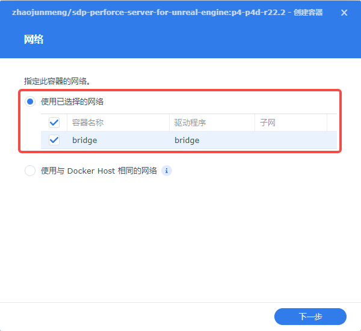
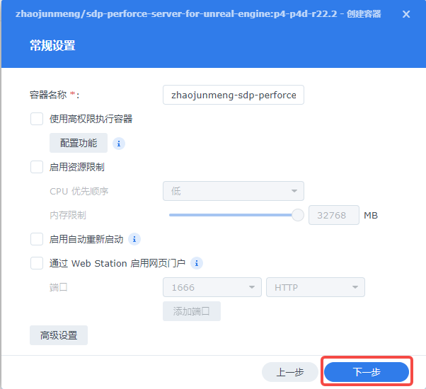
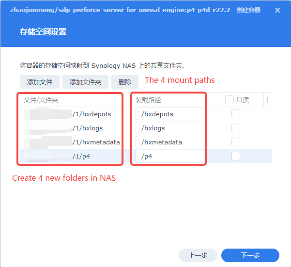
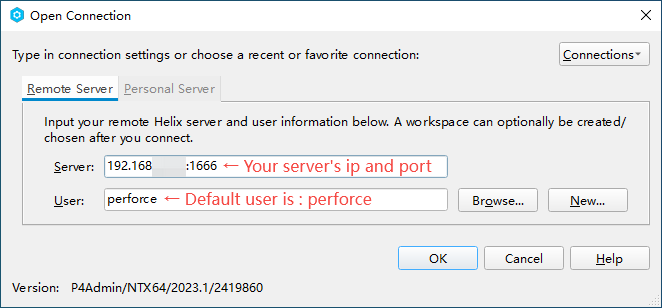

# 如何在群晖(NAS)上，部署一个为UnrealEngine定制的Perforce服务器

## 安装Docker

如果你的群晖没有安装Docker，首先需要在群晖的“套件中心”里面搜索Docker，并安装。

(安装Docker的方法就不在这里讲解了，可以自行搜索)

## 下载Docker image

在群晖的“Docker”里面，找到左侧的“映像”Tab，再点击“新增”-“从URL添加”，在弹出的界面中，粘贴下面的地址，然后“新增”按钮

<https://hub.docker.com/r/zhaojunmeng/sdp-perforce-server-for-unreal-engine>

## 启动容器

1. 在“映像”Tab，找到刚刚下载的Image，点击“启动”

    

2. 网络/常规设置界面，使用默认配置即可

    

    

3. 端口界面，填写你要映射的端口号。

    (P4默认的端口号习惯是1666)
    

4. 存储空间设置界面，要点击“添加文件夹”

    

    右边红圈里，/hxdepots, /hxlogs, /hxmetadata, /p4这4个目录是一定要提供的。

    左边红圈是在NAS里面的文件夹，是Docker启动以后，Perforce的数据文件等持久化的地方。

    

5. 点击完成，然后确认容器启动成功

    

    

## 连接到Perforce服务器

容器启动以后，需要首先使用[P4Admin](https://www.perforce.com/downloads/administration-tool)工具，登录Perforce服务器，才能创建新的depot，group和user。

>Server: 服务器的ip地址或者域名，外加之前启动容器步骤时设置的端口号，比如：1666
>
>User: the default and the only user is "perforce"(configured in p4-protect.cfg), enter the server ip

After click "OK", you must change the default password for user "perforce" (because security level is set to 3).

The old password is F@stSCM! by default (configured in Dockerfile: P4_PASSWD).

After login, you can create new depots, groups and users.

Enjoy!

## 如何实现

如何实现参考：[自己动手，在群晖(NAS)上，用Docker搭建Perforce服务器，版本控制Unreal项目](HowToSetupPerforceOnDockerForUnrealEngine.md)